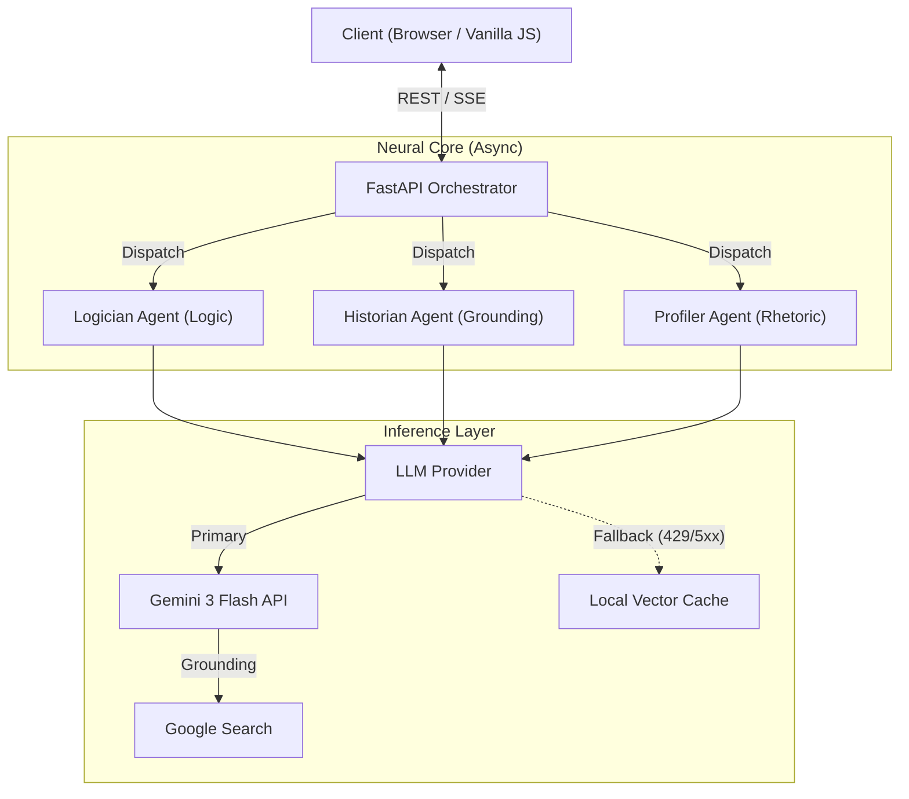

# RealityLens

**Cognitive Security & Logic Analysis Engine**
Live Deployment: [realitylens.domain.com](https://realitylens.domain.com)

RealityLens is an enterprise-grade cognitive firewall designed to detect, analyze, and deconstruct rhetorical manipulation in real-time. Unlike standard fact-checkers, it employs a multi-agentic architecture to strictly separate logical validity, historical verification, and rhetorical intent.

## Technical Abstract

The system operates as a stateless asynchronous microservice built on **FastAPI (Python 3.10+)**. It leverages the **Google GenAI SDK (Gemini 3 Flash)** for reasoning, utilizing a custom orchestration layer to manage parallel agent execution and streamed responses. Key architectural features include:

*   **Multi-Agent Syllogistic Processing**: Separation of concerns logic (Logos/Ethos/Pathos).
*   **Hybrid-Offline Resilience**: Deterministic fallback to a local cryptographic-grade cache during API latency/failure.
*   **Event-Driven Streaming**: Server-Sent Events (SSE) for non-blocking, rapid-fire analysis delivery.

## System Architecture



### 1. The Neural Orchestrator
Input text is ingested via REST endpoints and dispatched to the connection pool. The orchestrator spawns three concurrent asynchronous tasks, each governed by a strict system prompt and toolset:

*   **Agent A: The Logician (Structural Analysis)**
    *   *Role*: Pure deductive reasoning.
    *   *Function*: Identifies logical fallacies (Strawman, Ad Hominem), contradictions, and syllogistic errors.
    *   *Grounding*: Self-contained logic; zero external data access to prevent hallucination.

*   **Agent B: The Historian (Fact Verification)**
    *   *Role*: Empirical verification.
    *   *Function*: Cross-references claims against trusted external datasets via Google Search Grounding.
    *   *Output*: Verified origin tracing and primary source citation.

*   **Agent C: The Profiler (Rhetorical Telemetry)**
    *   *Role*: Sentiment and Intent classification.
    *   *Function*: Analyzes linguistic patterns to determine emotional manipulation or biases.

### 2. Resiliency Protocol (Offline Fallback)
To guarantee system availability in high-latency environments (e.g., demos, air-gapped networks), RealityLens implements a fuzzy-matching fallback layer.
**Graceful degradation when external AI services are unavailable.**

*   **Mechanism**: Uses `difflib.SequenceMatcher` to compare inputs against a pre-computed vector space of 100+ common misconceptions.
*   **Behavior**: If the primary inference API fails (5xx/429), the system transparently retrieves the nearest neighbor analysis from `cached_responses.json`.
*   **Continuity**: Frontend consumers receive identical data structures, ensuring zero downtime or UX degradation.

### Example Cached Responses
The system ships with 100+ high-fidelity pre-computed analyses for common misconceptions. Examples:

| Query | Logic Analysis (Logos) | Verification (Ethos) |
| :--- | :--- | :--- |
| *"Do we only use 10% of our brains?"* | **False**. Evolution would not sustain an energy-expensive organ that is 90% useless. fMRI shows activity across the entire cerebrum. | **Origin**: Misinterpretation of William James' work or Karl Lashley's experiments in the 1920s. |
| *"Does sugar make kids hyper?"* | **False**. Double-blind studies show no difference behaviorally between sugar and placebo. | **Origin**: 1970s Feingold Diet; primarily a psychological/environmental confirmation bias by parents. |
| *"Is the Earth flat?"* | **False**. Contradicts all geodetic and astronomical evidence. Gravity naturally shapes large mass objects into spheres. | **Origin**: Modern resurgence in 19th and 21st centuries as a rejection of institutional scientific authority. |

### 3. Frontend Implementation
The interface is a minimal, dependency-light **Vanilla JS (ES6)** application styled with utility-first CSS (**Tailwind**). It handles:
*   Real-time SSE stream consumption.
*   DOM-efficient updates for partial HTML fragments.
*   Secure input sanitation.

## Deployment & Configuration

### Requirements
*   Python 3.10+
*   Environment Variables configured for security.

### Installation

1.  **Clone Source**
    ```bash
    git clone https://github.com/huntwter/Reality-lens.git
    cd Reality-lens
    ```

2.  **Environment Security**
    Create a `.env` file. **Never commit this file.**
    ```bash
    GEMINI_API_KEY=your_secure_api_key
    ```

3.  **Dependency Initialization**
    ```bash
    pip install -r requirements.txt
    ```

4.  **Production Execution**
    Use a production-grade ASGI server (Uvicorn/Gunicorn):
    ```bash
    uvicorn main:app --host 0.0.0.0 --port 8000 --workers 4
    ```

## Development

To extend the agent capabilities, modify `app/agents/base.py` to implement new reasoning strategies. The standard interface requires an `analyze(input_text: str)` coroutine returning an `AgentResponse` schema.

---
*Copyright © 2026 RealityLens. All Rights Reserved.*
