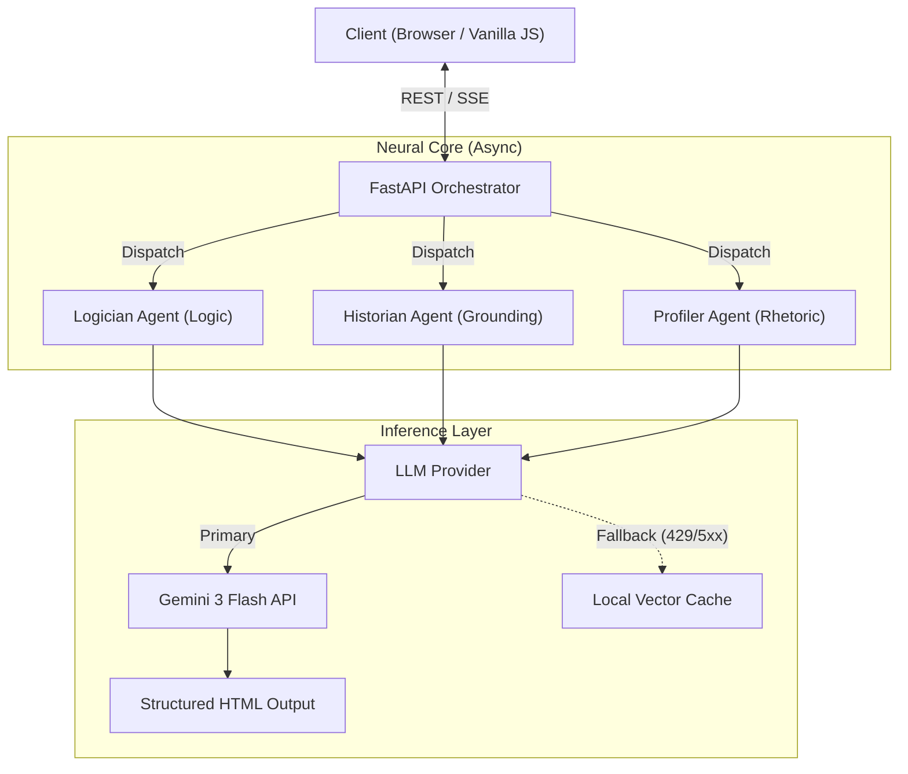

# RealityLens

**Cognitive Analysis Engine**

Live Deployment: [realitylens](https://reality-lens.onrender.com)

RealityLens is a cognitive analysis engine designed to help users understand how a claim or question is structured, framed, and emotionally presented. Instead of returning direct answers, the system analyzes input text across logical structure, narrative context, and rhetorical tone using structured Gemini 3 reasoning.

## Technical Abstract

The system operates as a stateless asynchronous microservice built on **FastAPI (Python 3.10+)**. It leverages the **Google GenAI SDK (Gemini 3 Flash)** for reasoning, utilizing a custom orchestration layer to manage parallel agent execution and streamed responses. Key architectural features include:

*  **Multi-Agent Reasoning Pipeline**: Separate agents analyze logical structure, narrative framing, and rhetorical tone.
*  **Graceful Fallback Mode**: When external AI services experience temporary latency or quota limits, the system switches to a demo-stable mode using pre-generated Gemini 3 sample analyses.
*  **Event-Driven Streaming**: Server-Sent Events (SSE) deliver incremental analysis results to the frontend.

## System Architecture



### 1. The Neural Orchestrator
Input text is ingested via REST endpoints and dispatched to the connection pool. The orchestrator spawns three concurrent asynchronous tasks, each governed by a strict system prompt and toolset:

*   **Agent A: The Logician (Structural Analysis)**
    *   *Role*: Pure deductive reasoning.
    *   *Function*: Identifies logical fallacies (Strawman, Ad Hominem), contradictions, and syllogistic errors.
    *   *Grounding*: Self-contained logic; zero external data access to prevent hallucination.

*   **Agent B: The Historian (Narrative Context)**
    *   *Role*: Narrative framing analysis.
    *   *Function*: Examines phrasing patterns to determine whether a narrative appears novel, recurring, or timeless.
    *   *Output*: Linguistic narrative context summary.

*   **Agent C: The Profiler (Rhetorical Telemetry)**
    *   *Role*: Sentiment and Intent classification.
    *   *Function*: Analyzes linguistic patterns to determine emotional manipulation or biases.


### 2. Resilience & Demo Stability

- During live operation, RealityLens performs real-time Gemini 3 reasoning calls.

- During demo or testing scenarios where external AI services may be temporarily unavailable, the system automatically switches to a demo-stable fallback mode, serving previously generated Gemini 3 analyses.

- This ensures uninterrupted user experience while preserving identical frontend orchestration behavior.


### Example Demo-Mode Gemini Outputs

To ensure uninterrupted demonstrations, the system includes a library of pre-generated Gemini 3 sample analyses for commonly tested queries. These samples illustrate the style and structure of RealityLens outputs when fallback mode is active.


| Example Query | Sample Logical Structure Summary | Sample Narrative Context Summary |
| :--- | :--- | :--- |
| "Do we only use 10% of our brains?" | The phrasing presents a claim framed as a scientific-sounding assertion without internal reasoning context. | The narrative style reflects a long-running popular myth pattern in public discourse. |
| "Does sugar make kids hyper?" | The query is structured as a cause–effect assumption framed as a behavioral concern. | The wording reflects a recurring parental-anxiety narrative style. |
| "Is the Earth flat?" | The sentence presents a direct contradiction-style claim structured as a challenge statement. | The phrasing aligns with modern contrarian narrative patterns rather than neutral inquiry framing. |


### 3. Frontend Implementation
The interface is a minimal, dependency-light **Vanilla JS (ES6)** application styled with utility-first CSS (**Tailwind**). It handles:
*   Real-time SSE stream consumption.
*   DOM-efficient updates for partial HTML fragments.
*   Secure input sanitation.

## Deployment & Configuration

### Requirements
*   Python 3.10+
*   Environment Variables configured for security.

### Installation

1.  **Clone Source**
    ```bash
    git clone https://github.com/huntwter/Reality-lens.git
    cd Reality-lens
    ```

2.  **Environment Security**
    Create a `.env` file. **Never commit this file.**
    ```bash
    GEMINI_API_KEY=your_secure_api_key
    ```

3.  **Dependency Initialization**
    ```bash
    pip install -r requirements.txt
    ```

4.  **Production Execution**
    Use a production-grade ASGI server (Uvicorn/Gunicorn):
    ```bash
    uvicorn main:app --host 0.0.0.0 --port 8000 --workers 4
    ```

## Development

To extend the agent capabilities, modify `app/agents/base.py` to implement new reasoning strategies. The standard interface requires an `analyze(input_text: str)` coroutine returning an `AgentResponse` schema.

---
## License

This project is licensed under Apache 2.0

---

© 2026 RealityLens — All Rights Reserved.

